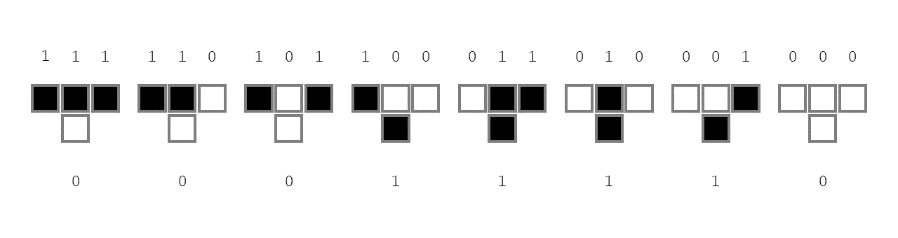
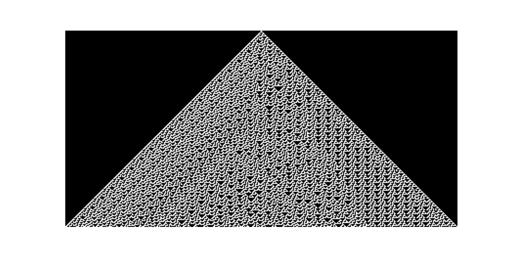

# CellularAutomata.jl

[SO FAR, THIS README IS A MORE OR LESS UNSTRUCTURED BRAIN DUMP! DO NOT REGARD THIS AS RELIABLE INFORMATION!]

This repository contains a very basic implementation of elementary cellular automata. So far, the code only affords cellular automata where each cell update is only contingent on its own current state and the state of its two neighbors.

Cellular automata provide a very useful vocabulary to describe natural self-organizing systems with discrete mathematical structures. They have a strikingly diverse range of application areas, from biology to physics, social science, and many more. Many natural systems move towards a state of maximum entropy or--more colloquially--chaos. However, this is not a universal rule. For instance, biological systems do not adhere to this principle. To a striking extent, biological systems exhibit the emergence of order from an initially chaotic state.

The core idea of expressing this emergent property in terms of cellular automata is to provide a toolkit of discrete structures in which these kinds of systems can be formally described. To get started, it is convenient to look at cellular automata which have a finite number of sites (cells) N. You can think of these cellular automata as one-dimensional lattices with periodic boundary conditions. Each cell has a state from a fixed set of possible states. In the simples case, this is simply the set {0, 1}.

In elementary cellular automata, the subsequent state of a cell is contingent on the current value of that cell as well as the value of the two adjacent cells (or neighbors if you think about it in a graph-theoretical way). The cell update can be thought of as a function which maps "cell triples" (the cell along with its two neighbors in the order they occur in the automaton) to a new state, i.e., some function {0, 1}^3 -> {0, 1}. The domain of this function consists of 2^3 = 8 possible values (think 3-bit binary numbers from 0 to 7). As these map to {0, 1}, there are 2^8 = 256 possible update rules under these constraints and there is a convenient numbering system for them called Wolfram codes:
The possible triples are interpreted as 3-bit binary number and are arranged in descending order (from 111 to 000). Each triple is then mapped to a bit representing the new cell state. These eight bits themselves can then be interpreted as a binary number again, and their decimal representation unambiguously identifies the function.

Here is an example:

Elementary cellular automata are often displayed as a sequence of state iterations from top to bottom:

(In this case, white cells represent cells with state 1 and black cells represent cells with state 0.)

## TO DO

[ ] improve plotting (colorscheme)  
[ ] refactor the entire mess  
[ ] develop a workflow  

